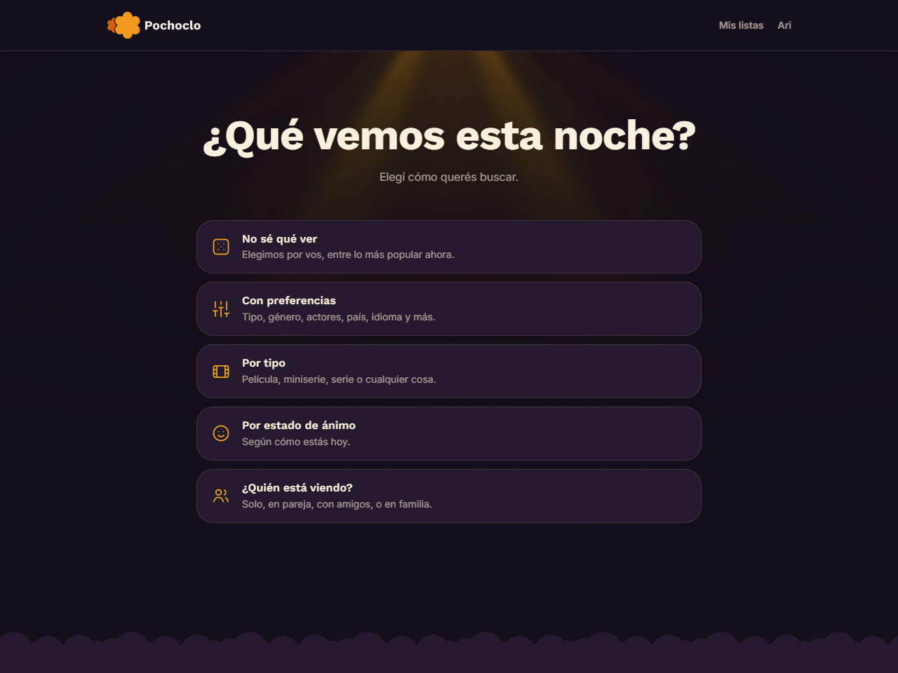
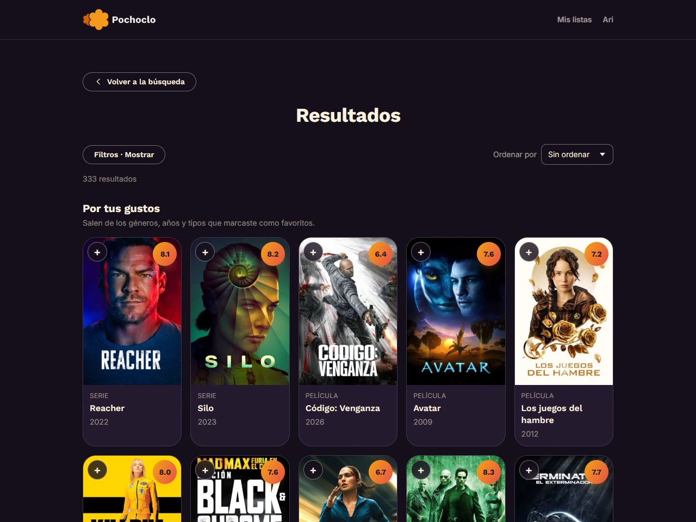

# Pochoclo

_Miralo a tu manera_


Aplicación web de recomendación de películas y series, usable con o sin cuenta. En producción: [pochoclo.ar](https://pochoclo.ar/)

## Qué problema resuelve

La mayoría de los catálogos arrancan pidiendo género, año y plataforma, o sea que solo sirven si estás medianamente decidido. Con Pochoclo, podes elegir algo tan simple como tu estado de ánimo, y la búsqueda se arma sola.

Hay cinco flujos de búsqueda distintos (no cinco filtros del mismo formulario), y tres de ellos no piden ningún criterio:

| Opción                | Qué pide                                               |
| --------------------- | ------------------------------------------------------ |
| “No sé qué ver”       | Nada                                                   |
| “¿Estado de ánimo?”   | Reírme, llorar, asustarme, volar mi mente, y siete más |
| “¿Quién está viendo?” | Solo, en pareja, con amigos, en familia                |
| “Quiero…”             | Película, serie o miniserie                            |
| Preferencias          | El formulario completo                                 |



Y “Me siento con suerte” en cualquier formulario, que devuelve un solo título.

Además, se suman campos que no se encuentran en otros catálogos. “Parecido a” otro título, “complejidad” (algo para relajar o algo para pensar) y la duración total de una serie, que es lo que permite pedir una que se pueda terminar en un fin de semana. Además, teniendo una cuenta se suman las listas “Favoritas”, “Visto” y “Ver más tarde”, y plataformas y gustos registrados, que cambian lo que se recomienda. Lo marcado como visto deja de aparecer.

Algunas ideas abiertas son la posibilidad de interpretar lenguaje natural y distinguir lo masivo de lo de nicho. Ninguna se encuentra implementada actualmente.

## Stack

| Frontend        | React 19, React Router, Vite, Tailwind CSS 4                           |
| --------------- | ---------------------------------------------------------------------- |
| Backend         | Node.js 18+, Express, PostgreSQL (Neon)                                |
| Autenticación   | Better Auth autoalojado                                                |
| Datos           | API de TMDb (fuente primaria), TVMaze (duración de series)             |
| Infraestructura | Cloudflare Pages y Functions, túnel de Cloudflare, systemd sobre Linux |

## Cómo funciona

Las búsquedas se resuelven en vivo contra los ~1.400.000 títulos de TMDb, no hay un catálogo propio. PostgreSQL guarda los datos de los usuarios y un caché del detalle de cada título ya consultado. Se evaluó precargar el catálogo entero y se descartó ya que cuesta diez minutos y cincuenta megas, y termina dando peores resultados que consultar en vivo.

```
Navegador ──► Cloudflare Pages (frontend estático + Functions en el borde)
                    │
                    └──► api.pochoclo.ar ──► túnel de Cloudflare
                                                   │
                                    servidor Linux (Express, systemd)
                                                   │
                                     ┌─────────────┴─────────────┐
                                  TMDb                    PostgreSQL (Neon)
                              (en vivo)              (usuarios + caché)
```



El frontend y el backend se despliegan por separado y no dependen uno del otro para publicarse.

## Decisiones de ingeniería relevantes

Todo lo que sigue está medido, con el antes y el después anotado. Hay 19 casos desarrollados con sus números en `DECISIONES.md`, incluidos los que se midieron y se decidió no hacer.

- **Rendimiento del motor de búsqueda:** El peor caso que se encontró al inicio del desarrollo (cinco países \* cuatro décadas) pasó de 86 a 3 segundos. TMDb no entiende “Argentina o México”, así que había que hacer una llamada por combinación. Se resolvió con un pool de concurrencia propio, un tope de candidatos repartido por turnos entre consultas (para que un país no se coma el cupo de los otros) y dos niveles de caché. El límite de concurrencia salió de medir dónde empieza a degradarse la API: a 80 pedidos en paralelo responde en 823 ms, a 100 sube a 2301 ms. Ver `src/buscador/motorBusqueda.js` y `src/utils/concurrencia.js`.
  El problema verdadero fue surgiendo más adelante, ya que nada acotaba el producto cartesiano, así que se podían pedir tantos países y tantos años como uno quisiera. Probé armar una búsqueda muchísimo más compleja pero dentro de todo realista. Necesitaba 1335 consultas y tardaba 34 segundos. De esas 1335 consultas solo 183 aportaron algún título al resultado, porque el reparto por turnos llenaba el cupo de candidatos en la primera vuelta. Pedir más consultas que el tope no puede traer más resultados, solo más espera. Buscando si el mismo defecto estaba en otro lado apareció que si tenía gustos guardados con cinco géneros y todas las décadas, producían 8670 consultas y tardaba 134 segundos, se llegaba eligiendo de las listas de la propia pantalla, y quedaba guardado, así que esa persona lo volvía a pagar en cada búsqueda personalizada. Los tres quedaron acotados en un solo lugar, el punto por donde pasan los tres generadores de consultas, que deduce los grupos de la propia consulta en vez de pedírselos a quien llama. Por consecuencia, una función nueva hereda la protección sin que nadie tenga que acordarse. Ver punto 20 de `DECISIONES.md`.
- **Escrituras en lote.** Guardar 200 títulos eran 600 consultas separadas, aproximadamente 4 segundos de latencia de red. Hoy es un solo `INSERT` que recibe el lote como JSON y lo expande con `jsonb_to_recordset`, tardando solamente 200ms. Ver `src/repositories/titulos.js`.
- **Calibración de las recomendaciones.** Esta es una cuestión que no pensé que iba a traer muchos problemas, pero resultó ser una de las que más trabajo llevó. TMDb utiliza “keywords” o palabras clave para cada título. Un título puede tener múltiples keywords, o ninguna. El problema es que estas keywords no describen al título, sino que etiquetan por lo que aparece en pantalla, así que la palabra clave “christmas” (navidad) trae Harry Potter. A su vez, los géneros son bastante vagos. El género “Acción” trae épica de fantasía por ejemplo, por lo que se aplica una calibración para ciertos géneros. Hay un procedimiento repetible para detectar estas cuestiones (`src/scripts/calibrarGenero.js`, `calibrarTono.js`) y las correcciones viven en una tabla compartida, `CORRECCIONES_POR_GENERO` en `src/data/genres.js`.
- **Accesibilidad WCAG 2.2 AA.** Hay tres capas: axe-core sobre 31 pantallas, revisión manual con lector de pantalla, y scripts propios que le piden a Chrome el árbol de accesibilidad por DevTools Protocol y lo transcriben a lo que se escucharía. Las herramientas automáticas daban cero y la revisión manual encontró nueve defectos, ninguno de ellos una etiqueta faltante. Ver `frontend/lector-simulado.mjs` y los tres `recorrido-lector*.mjs`.
- **Metadatos para rastreadores sin JavaScript.** Los bots de redes sociales y de asistentes de IA leen el HTML de la primera respuesta y nada más. Como el frontend se sirve estático, el backend nunca ve ese pedido. Se resolvió con Cloudflare Functions que detectan al rastreador y reescriben el HTML en el borde; para cualquier visitante humano el pedido sigue el camino de siempre y no paga nada. Ver `frontend/functions/`.
- **Operación.** Respaldos diarios que se verifican restaurándolos de verdad (`npm run respaldo-simulacro` crea una cuenta, respalda, borra todo, restaura y vuelve a iniciar sesión con ella) y un monitoreo de 13 chequeos que avisa por correo. Uno de esos chequeos pide la URL pública, ya que por ejemplo hubo una caída de una hora con el proceso vivo y sin unidades fallidas, porque lo que se había muerto eran las conexiones del túnel.

## Correrlo en local

Requiere Node 18 o superior, una base PostgreSQL (sirve el plan gratuito de [Neon](https://neon.tech/)) y un token de lectura de la [API de TMDb](https://www.themoviedb.org/settings/api).

No es un monorepo. Cada carpeta se instala por separado.

```bash
# Backend
cd backend
npm install
cp .env.example .env        # completar DATABASE_URL y TMDB_API_TOKEN
npm run migrate             # crea el esquema
npm run seed                # ~2000 títulos de arranque
npm run recalcular          # agregados del catálogo (C, máximos, clásicos)
npm run dev                 # http://localhost:3000

# Frontend, en otra terminal
cd frontend
npm install
cp .env.example .env        # VITE_API_URL=http://localhost:3000
npm run dev                 # http://localhost:5173
```

`npm run seed-tvmaze` es opcional y tarda unos diez minutos. Lo que hace es espejar el catálogo de TVMaze para obtener información detallada de las series y poder responder “una serie que termine en un fin de semana”.

Los pasos completos, con los avisos de consola esperables y qué hacer si algo falla, están en `backend/README.md` y `frontend/README.md`.

## Scripts del backend

| Comando                      | Para qué sirve                                      |
| ---------------------------- | --------------------------------------------------- |
| `npm run dev`                | Servidor con recarga                                |
| `npm run migrate`            | Crea o actualiza el esquema                         |
| `npm run seed`               | Carga títulos de arranque                           |
| `npm run seed-tvmaze`        | Espeja el catálogo de TVMaze                        |
| `npm run recalcular`         | Recalcula los agregados del catálogo                |
| `npm run probar`             | Comprobaciones de las fórmulas de puntuación        |
| `npm run verificar-auth`     | Compara el esquema de Better Auth con la base real  |
| `npm run respaldo`           | Respaldo de los datos de usuario                    |
| `npm run respaldo-simulacro` | Respalda, borra, restaura y verifica                |
| `npm run precalentar`        | Calienta el caché de los puntos de entrada fijos    |
| `npm run mantenimiento`      | Orquesta respaldo, precalentado, latido y recálculo |
| `npm run vigilancia`         | 13 chequeos de salud con aviso por correo           |

## Mapa del repositorio

```
backend/src/
  buscador/      motor de búsqueda y armado de candidatos
  opciones/      los cinco flujos, "parecido a", prioridades, cruce de tipos
  logic/         puntuación, clasificación, complejidad, límite de edad
  data/          géneros, keywords, estados de ánimo, certificaciones
  services/      clientes de TMDb y TVMaze
  repositories/  acceso a PostgreSQL
  auth/          Better Auth, validaciones, correo
  scripts/       mantenimiento, respaldos, vigilancia, calibración

frontend/src/
  paginas/       una por ruta
  components/    reutilizables, incluidos los efectos visuales
  utils/         espejo en cliente de los filtros del backend, caché corta
frontend/functions/   Cloudflare Functions (metadatos para rastreadores)
```

### Sobre los comentarios del código

Los comentarios citan “el Definitivo” y secciones numeradas del tipo “ver 4.15.8”. Son dos documentos de trabajo del proyecto, la especificación de producto y un registro de implementación, que no forman parte de este repositorio. Llevan notas de infraestructura y de operación que no aportan nada a quien lee el código. Lo esencial de los dos está recogido en `DECISIONES.md`.

## Estado

Las versiones 1, 2 y 3 están terminadas y el sitio está publicado desde el 29 de agosto de 2026. La v4 (una extensión de Chrome) está relevada y sin empezar.

## Cómo se construyó

El código lo escribió Claude Code. Las decisiones las tomé yo. El proyecto no se hizo en un día o en una semana. Supervisé a lo largo de cada entrega. Hice el análisis y el diseño. Ideé y planifiqué, y realicé formulas para calcular la popularidad de un título, la puntuación, si debe ser clasificado como “clásico”, y la lógica en la mezcla de títulos, sea por listas o por “Parecido a”. Pensé, diseñé y creé la imagen de Pochoclo, tanto el logo (isotipo, logotipo, imagotipo e imagotipo con eslogan) como la paleta de colores, las fuentes, el nombre y el eslogan. Corregí errores puntuales. Me informé con cursos sobre cada tema o lenguaje que se usó para garantizar calidad, investigué herramientas alternativas a las propuestas (como el uso de Ubuntu Server) o herramientas para añadir al proyecto (como las decoraciones de LightRays), averigüé sobre cuestiones legales y de accesibilidad, y realicé todos los trámites necesarios para llevar a cabo el proyecto, como el registro del dominio y su configuración, o el registro en AAIP. Controlé qué medir, qué construir, qué rechazar y cuándo la respuesta correcta era no hacerlo. `DECISIONES.md` es el registro de eso, y varias de sus entradas son cosas que se implementaron, se midieron y se descartaron.

Lo digo acá porque me parece honesto, y porque el criterio para crear y dirigir un proyecto así es una habilidad distinta de escribir el código, no un atajo para saltearla.

## Datos y atribución

Este producto usa la API de TMDb, pero no está respaldado ni certificado por TMDb. Las duraciones de series se completan con datos de TVMaze.
